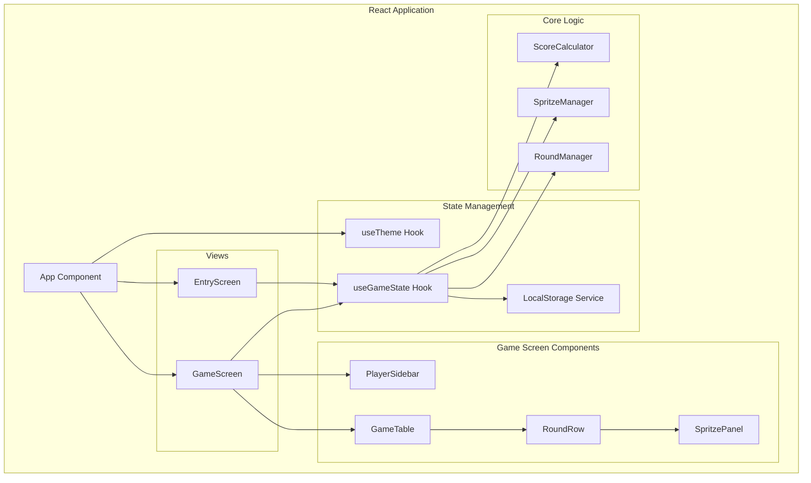

# Design Document: Doppelkopf Scorer

## Overview

The Doppelkopf Scorer is a single-page React application built with TypeScript, Vite, and styled-components. It provides a shared-screen scoring companion for live Doppelkopf card game sessions. The app follows a clean, paper-like aesthetic with minimal animations and supports both light and dark themes.

The application consists of two main views: an Entry Screen for game configuration and a Game Screen for active scoring. All game state persists to local storage, enabling session continuity.

## Architecture



### Component Hierarchy

```
App
├── ThemeProvider
│   ├── EntryScreen (when no active game)
│   │   ├── PlayerSetupForm
│   │   │   └── PlayerInput (×4)
│   │   └── SpritzeModeSelector
│   │
│   └── GameScreen (when game active)
│       ├── PlayerSidebar
│       │   ├── PlayerCard (×4)
│       │   ├── ResetButton
│       │   └── ThemeToggle
│       │
│       └── GameTable
│           ├── TableHeader
│           └── RoundRow (×n)
│               ├── RoundNumber
│               ├── PlayerCell (×4)
│               ├── SpritzeDisplay
│               └── SpritzeCheckboxes (Normal mode only)
```

## Components and Interfaces

### App Component
The root component managing routing between Entry and Game screens based on game state existence.

```typescript
interface AppProps {}

// Renders ThemeProvider wrapper
// Checks localStorage for existing game
// Routes to EntryScreen or GameScreen
```

### EntryScreen Component
Handles initial game configuration with player setup and mode selection.

```typescript
interface EntryScreenProps {
  onGameStart: (config: GameConfig) => void;
}

interface GameConfig {
  players: PlayerConfig[];
  spritzeMode: 'normal' | 'custom';
  enabledSpritzeTypes?: SpritzeType[]; // Normal mode only
}

interface PlayerConfig {
  name: string;
  color: string;
}
```

### GameScreen Component
Main game view containing sidebar and scoring table.

```typescript
interface GameScreenProps {
  gameState: GameState;
  onStateChange: (newState: GameState) => void;
  onReset: () => void;
}
```

### PlayerSidebar Component
Displays player standings, reset button, and theme toggle.

```typescript
interface PlayerSidebarProps {
  players: Player[];
  onReset: () => void;
  onThemeToggle: () => void;
  currentTheme: 'light' | 'dark';
}

interface Player {
  id: string;
  name: string;
  color: string;
  totalScore: number;
  position: number;
}
```

### GameTable Component
Renders the scoring grid with all rounds.

```typescript
interface GameTableProps {
  rounds: Round[];
  players: Player[];
  spritzeMode: 'normal' | 'custom';
  currentRoundIndex: number;
  onWinnerToggle: (roundIndex: number, playerId: string) => void;
  onSpritzeChange: (roundIndex: number, spritzes: SpritzeState) => void;
  onAcceptRound: (roundIndex: number) => void;
  onResetRound: (roundIndex: number) => void;
}
```

### RoundRow Component
Single row in the game table representing one round.

```typescript
interface RoundRowProps {
  round: Round;
  roundNumber: number;
  players: Player[];
  isCurrentRound: boolean;
  isPreviousRound: boolean;
  spritzeMode: 'normal' | 'custom';
  onWinnerToggle: (playerId: string) => void;
  onSpritzeChange: (spritzes: SpritzeState) => void;
  onAccept: () => void;
  onReset: () => void;
}
```

### SpritzePanel Component
Displays and manages Spritze selections for a round.

```typescript
interface SpritzePanelProps {
  mode: 'normal' | 'custom';
  spritzeState: SpritzeState;
  carryOverSpritzes: CarryOverSpritze[];
  isLocked: boolean;
  onChange: (state: SpritzeState) => void;
}

interface SpritzeState {
  // Normal mode
  selectedTypes?: SpritzeType[];
  // Custom mode
  customCount?: number;
}

interface CarryOverSpritze {
  playerId: string;
  roundsRemaining: number;
  originRoundIndex: number;
}
```

## Data Models

### Core Types

```typescript
// Spritze type definitions (hardcoded for normal mode)
type SpritzeType = 
  | 'below_90'      // Losers below 90 points
  | 'below_60'      // Losers below 60 points
  | 'below_30'      // Losers below 30 points
  | 'schwarz'       // Losers at 0 points
  | 'against_queens' // Won against queens
  | 'solo'          // Solo game
  | 'announced';    // Announced win

interface Round {
  id: string;
  roundNumber: number;
  winners: string[];           // Player IDs
  spritzeState: SpritzeState;
  carryOverSpritzes: CarryOverSpritze[];
  isAccepted: boolean;
  pointsAwarded: number | null; // Calculated on acceptance
  playerResults: PlayerRoundResult[];
}

interface PlayerRoundResult {
  playerId: string;
  isWinner: boolean;
  pointsGained: number;
}

interface GameState {
  id: string;
  config: GameConfig;
  players: Player[];
  rounds: Round[];
  currentRoundIndex: number;
  createdAt: string;
  updatedAt: string;
}
```

### State Shape for Local Storage

```typescript
interface PersistedState {
  gameState: GameState | null;
  theme: 'light' | 'dark';
}
```

## Score Calculation Logic

```typescript
// Core calculation function
function calculateRoundPoints(totalSpritzes: number): number {
  const BASE_POINTS = 10;
  return BASE_POINTS * Math.pow(2, totalSpritzes);
}

// Count total spritzes for a round
function countTotalSpritzes(
  spritzeState: SpritzeState,
  carryOverSpritzes: CarryOverSpritze[],
  mode: 'normal' | 'custom'
): number {
  const activeSpritzes = mode === 'normal' 
    ? (spritzeState.selectedTypes?.length ?? 0)
    : (spritzeState.customCount ?? 0);
  
  const carryOverCount = carryOverSpritzes.length;
  
  return activeSpritzes + carryOverCount;
}

// Apply round results
function applyRoundResults(
  gameState: GameState,
  roundIndex: number
): GameState {
  const round = gameState.rounds[roundIndex];
  const totalSpritzes = countTotalSpritzes(
    round.spritzeState,
    round.carryOverSpritzes,
    gameState.config.spritzeMode
  );
  const pointsAwarded = calculateRoundPoints(totalSpritzes);
  
  // Update player totals for winners
  const updatedPlayers = gameState.players.map(player => ({
    ...player,
    totalScore: round.winners.includes(player.id)
      ? player.totalScore + pointsAwarded
      : player.totalScore
  }));
  
  // Calculate positions
  const sortedScores = [...new Set(updatedPlayers.map(p => p.totalScore))]
    .sort((a, b) => b - a);
  
  const playersWithPositions = updatedPlayers.map(player => ({
    ...player,
    position: sortedScores.indexOf(player.totalScore) + 1
  }));
  
  return {
    ...gameState,
    players: playersWithPositions,
    rounds: gameState.rounds.map((r, i) => 
      i === roundIndex 
        ? { ...r, isAccepted: true, pointsAwarded }
        : r
    )
  };
}
```

## Carry-Over Spritze Logic

```typescript
// Generate carry-over spritzes for losers
function generateCarryOverSpritzes(
  round: Round,
  allPlayerIds: string[]
): CarryOverSpritze[] {
  const losers = allPlayerIds.filter(id => !round.winners.includes(id));
  
  return losers.map(playerId => ({
    playerId,
    roundsRemaining: 2,
    originRoundIndex: round.roundNumber - 1
  }));
}

// Decrement carry-over counters and filter expired
function processCarryOverSpritzes(
  carryOvers: CarryOverSpritze[]
): CarryOverSpritze[] {
  return carryOvers
    .map(co => ({ ...co, roundsRemaining: co.roundsRemaining - 1 }))
    .filter(co => co.roundsRemaining > 0);
}

// Remove carry-overs originating from a specific round (for undo)
function removeCarryOversFromRound(
  carryOvers: CarryOverSpritze[],
  originRoundIndex: number
): CarryOverSpritze[] {
  return carryOvers.filter(co => co.originRoundIndex !== originRoundIndex);
}
```

## Error Handling

### Input Validation
- Empty player names: Prevent form submission, highlight invalid fields
- Duplicate player names: Allow (players distinguished by ID and color)
- Invalid Spritze count: Clamp to 0 minimum, no maximum enforced

### State Consistency
- Round reset validation: Only allow reset of immediately previous round
- Spritze modification: Prevent changes to accepted rounds
- Local storage corruption: Fall back to fresh game state on parse errors

### Edge Cases
- Zero winners: Valid state, no points awarded
- All four winners: Each receives full round points
- Browser refresh during round: Restore last persisted state (current round may be incomplete)

## Correctness Properties

*A property is a characteristic or behavior that should hold true across all valid executions of a system—essentially, a formal statement about what the system should do. Properties serve as the bridge between human-readable specifications and machine-verifiable correctness guarantees.*

### Property 1: Empty Player Name Rejection
*For any* game configuration where at least one player name is empty or whitespace-only, the Scorer should reject the configuration and prevent game start.
**Validates: Requirements 1.6**

### Property 2: Position Calculation with Ties
*For any* set of player scores, positions should be assigned such that: (a) higher scores receive lower position numbers, (b) players with equal scores receive the same position number, and (c) positions are consecutive starting from 1.
**Validates: Requirements 2.3, 2.5**

### Property 3: Round Number Increment
*For any* game state, when a new round is added, its round number should equal the previous round's number plus 1 (or 1 if it's the first round).
**Validates: Requirements 3.1**

### Property 4: Round Reset State Restoration
*For any* game state with at least one accepted round, resetting the last round should restore player totals to their values before that round was accepted.
**Validates: Requirements 3.5**

### Property 5: Reset Restriction to Last Round
*For any* game state with multiple accepted rounds, attempting to reset any round other than the immediately previous one should be rejected.
**Validates: Requirements 3.6**

### Property 6: Carry-Over Removal on Reset
*For any* round reset operation, all carry-over Spritzes that originated from the reset round should be removed from subsequent rounds.
**Validates: Requirements 3.7**

### Property 7: Score Recalculation on Reset
*For any* game state after a round reset, each player's total score should equal the sum of points gained from all remaining accepted rounds.
**Validates: Requirements 3.8**

### Property 8: Winner Count Bounds
*For any* round, the number of winners must be between 0 and 4 inclusive.
**Validates: Requirements 4.2**

### Property 9: Winner Score Addition
*For any* accepted round, each winner's total score should increase by exactly the calculated round points.
**Validates: Requirements 4.5**

### Property 10: Spritze Immutability After Acceptance
*For any* accepted round, the Spritze state (selected types in normal mode, count in custom mode) should not be modifiable.
**Validates: Requirements 5.4, 6.3**

### Property 11: Score Calculation Formula
*For any* non-negative integer Spritze count n, the calculated round points should equal exactly 10 × 2^n.
**Validates: Requirements 7.2**

### Property 12: Spritze Additive Stacking
*For any* round, the total Spritze count used in calculation should equal the sum of active Spritzes plus the count of carry-over Spritzes.
**Validates: Requirements 7.3**

### Property 13: Full Points to Each Winner
*For any* accepted round with multiple winners, each winner should receive the full round points (not divided among winners).
**Validates: Requirements 7.4**

### Property 14: Carry-Over Generation for Losers
*For any* accepted round, each non-winner should generate exactly one carry-over Spritze with a duration of 2 rounds.
**Validates: Requirements 7.5**

### Property 15: Game State Persistence Round-Trip
*For any* valid game state, serializing to local storage and then deserializing should produce an equivalent game state.
**Validates: Requirements 8.1, 8.2**

### Property 16: Theme Persistence
*For any* theme setting (light or dark), persisting and then loading should restore the same theme.
**Validates: Requirements 9.5**

## Testing Strategy

- No tests required.
